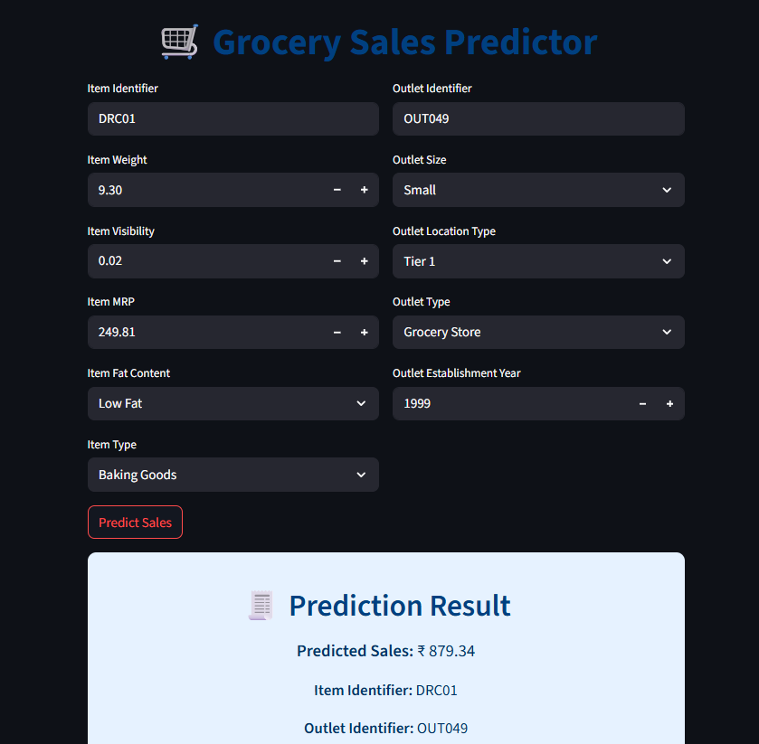

# 🛒 GrocerGenius: AI-Based Supermarket Sales Prediction

This project is a Streamlit-based machine learning web app that predicts the sales of grocery store items based on historical outlet and product data.

It was built as part of the **Infosys Springboard Internship (Oct 2024)**, applying end-to-end data science practices — from data cleaning to feature engineering, model training, and deployment.

---

## 🚀 Live Demo

👉 **Try it now:**  
🔗 [https://ndtb68qdcq4jqgpzhvcldk.streamlit.app/](https://ndtb68qdcq4jqgpzhvcldk.streamlit.app/)

---

## 📊 Features

- ✅ Real-time sales prediction using user input
- ✅ XGBoost regression model trained on retail data
- ✅ Clean and responsive UI using Streamlit
- ✅ Intelligent feature engineering:
  - Visibility ratios
  - Price-per-weight
  - Outlet age
- ✅ Support for categorical encodings like LOO, one-hot, ordinal

---

## 🧠 Model Summary

- **Algorithm:** XGBoost Regressor
- **Features used:** 33 engineered features including outlet/item characteristics
- **Training samples:** 6,818
- **Trained using:** Scikit-learn, XGBoost, NumPy, pandas
- **Model file:** `models/xgboost_sales_model.pkl`

---

## 🖼 Interface Preview



---

## 🛠 Run Locally (Optional)

### 1. Clone the Repository

```bash
git clone https://github.com/theamansyed/GrocerGenius_Al_Based_Supermarket_Sales_Prediction_Infosys_Internship_-Oct2024.git
cd GrocerGenius_Al_Based_Supermarket_Sales_Prediction_Infosys_Internship_-Oct2024

